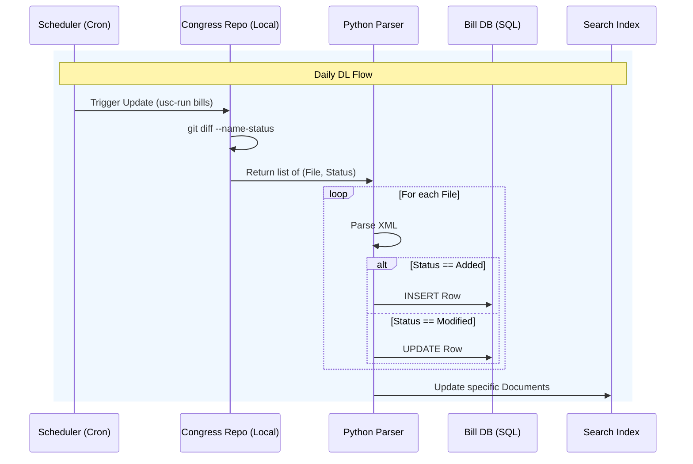

# 🤖 Chatbot for Bill Retrieval — Full Design Doc

---

## Table of Contents

1. [High Level Design](#high-level-design)
2. [Pipelines](#pipelines)
3. [SQL Scripts](#sql-scripts)
4. [XML to SQL Mapper](#xml-to-sql-mapper)
5. [Elasticsearch Setup](#elasticsearch-setup)
6. [Gemini Setup and Prompt](#gemini-setup-and-prompt)
7. [Backend for Frontend](#backend-for-frontend)
8. [Docker Files](#docker-files)
9. [Ingest Universe](#ingest-universe)

---

## High Level Design

Build a chatbot that can answer questions about a specific set of news articles or a documentation knowledge base. The **ETL** process ingests and processes a small corpus of text documents. Use a pre-trained **NLP model** for semantic similarity or a simple keyword-matching algorithm to find the most relevant document snippet in response to a user's query.

**NEW** — Try bills instead of news! Download bill data and allow LLMs to make sense of legislative vocabulary.

### Data Endpoints

- Bulk data of bills: https://projects.propublica.org/datastore/#congressional-data-bulk-legislation-bills
- GitHub repo for bill updates: https://github.com/unitedstates/congress?tab=readme-ov-file
- GitHub repo for legislator info: https://github.com/unitedstates/congress-legislators
- Linkify legal docs: https://github.com/govtrack/linkify-citations/tree/xpath-rewrite

### UI Overview

The UI is a search bar that allows users to search and choose any bill to learn more about. They choose one and are moved to a chatbot page where they can ask questions directly about the bill. There's also an option to view the full text of the bill.

### Backend Overview

The backend is an offline pipeline that runs daily, feeding into a database (with Elasticsearch or vector DB search functionality) and a universe download pipeline to initialize the DB with all bills ever.

There is a separate job that creates a search index. An API server handles both the Bill DB and the Search Index. A frontend server serves the website, takes web requests, calls those APIs, and calls Gemini for chatbot use.

### Detailed Design

#### Universe DL

Uses the [congress GitHub repo](https://github.com/unitedstates/congress/wiki/bills) to bulk download all bills from congress and store them in XML files locally.

```bash
$ usc-run govinfo --bulkdata=BILLSTATUS
```

The XML schema is documented [here](https://github.com/usgpo/bill-status/blob/main/BILLSTATUS-XML_User_User-Guide.md#7-data-set). Once downloaded, each XML is processed and inserted into the database. Run monthly to catch any missed updates.

#### Daily DL

Once the BILLSTATUS corpus is downloaded, a second function finds new or updated bills:

```bash
$ usc-run bills
$ git status
```

Changed and added XML files are read and the database is updated accordingly (`UPDATE` for modified, `INSERT` for new).

#### Bill DB

The Bill DB needs enough information for good search indexing and to retrieve full bill text when needed. It also tracks last updated, introduction, and insertion dates.

**`bill_table`**
- `Id = {congress}_{bill_type}_{bill_number}`
- `bill_type`, `bill_url`, `latest_action_date`, `latest_action`, `introduced_date`, `title`, `summary`, `congress`, `chamber`, `bill_number`

**`legislative_subjects`** — `id`, `subject`

**`bill_to_subject`** — `id`, `bill_id`, `subject_id`

**`representatives`** — `id` (bioguide/gpoid/lisid), `first_name`, `last_name`, `state`, `party`

**`bill_to_sponsor`** — `id`, `bill_id`, `representative_id`

**`bill_to_cosponsor`** — `id`, `bill_id`, `representative_id`, `sponsorship_date`, `is_original_cosponsor`

**`related_bills`** — `id`, `originating_bill`, `referenced_bill`

#### Search Index

Using Elasticsearch. Index document schema:

- `bill_id`, `bill_congress`, `bill_chamber`, `bill_title`, `bill_summary`
- `bill_sponsor` (full name)
- `bill_cosponsors` (comma-separated full names)
- `bill_subjects` (comma-separated subjects)
- `introduction_date`

#### Bill DB API

Simple interface: provide a `bill_id`, query the database, and return the data. An additional endpoint returns the full bill text via `wget` using the `bill_text_url`. Requires a cache and rate limiting.

#### Search API

Expose Elasticsearch directly or build a simple API with a single `search` endpoint that takes free text and returns cleaned results. Requires a cache and rate limiting.

#### Frontend

A simple Go webserver with two HTML pages:
1. **Search Landing Page** — search and choose a bill
2. **Chatbot Page** — talk to a chatbot about the selected bill

---

## Pipelines

### Design Doc: Bill Data Ingestion Pipelines

#### 1. Overview

The ingestion layer consists of two offline pipelines:

1. **Universe DL (The Initializer):** Bulk-operation pipeline for initial hydration or massive reconciliation.
2. **Daily DL (The Updater):** Incremental pipeline to run daily and capture new legislative activity.

#### 2. Shared Data Transformation (XML to DB)

Both pipelines share a common **XML Parser** logic block. This should be abstracted into a shared service or library.

**Mapping Logic:**
- **Source:** `BILLSTATUS-XML` (standard GPO format)
- **Destination:** SQL Relational Tables
- **Key Extraction:**
  - `bill/billType` + `bill/billNumber` + `bill/congress` → Unique **Bill ID**
  - `bill/actions` → Sort by date to determine `latest_action` and `latest_action_date`
  - `bill/sponsors` & `bill/cosponsors` → Map to junction tables

#### 3. Pipeline I: Universe DL (Bulk Ingestion)

**Frequency:** Monthly (or on-demand)  
**Objective:** Complete download and parsing of all available legislative history.

**Workflow:**
1. Ensure local storage has sufficient space for the unzipped XML corpus.
2. Fetch data: `$ usc-run govinfo --bulkdata=BILLSTATUS`
3. Recursively walk the directory tree to find all `.xml` files.
4. Process in batches (e.g., 100 files), performing `INSERT IGNORE` (or `UPSERT`) into Bill DB.
5. Once complete, trigger bulk re-index for Elasticsearch.

**Failure Recovery:** Log the last successfully processed Congress session/directory for checkpoint-based resumption.

#### 4. Pipeline II: Daily DL (Incremental Ingestion)

**Frequency:** Daily (e.g., 02:00 UTC)  
**Objective:** Identify deltas and propagate them to the DB and Search Index.

**Workflow:**
1. Navigate to the local clone of the `congress` data repository and run: `$ usc-run bills`
2. Identify changed files using: `$ git diff --name-status HEAD@{1} HEAD`
   - `A` (Added) → New Bill
   - `M` (Modified) → Update Bill
3. Process: Added → `INSERT`, Modified → `UPDATE` (update `latest_action`, `summary`, `last_updated`)
4. Batch-update Elasticsearch with only the processed `bill_id`s.

**Edge Cases:**
- **Schema Drift:** Store failed XML parses in a Dead Letter Queue table for manual review.
- **Git Conflicts:** Ensure local repo is strictly read-only for the pipeline.

#### 5. Implementation Roadmap & Tools

| Component | Tool/Library | Reason |
|---|---|---|
| **Orchestrator** | `Cron` or `Airflow` | Simple cron for MVP; Airflow if dependencies grow |
| **Scripting** | Python | Excellent XML parsing (`lxml`) and DB drivers (`psycopg2`/`SQLAlchemy`) |
| **Git Interaction** | `GitPython` | Programmatic access to `git diff` and logs |
| **Parser** | `lxml` | Faster than standard `xml.etree` for large datasets |

#### 6. Diagram: Ingestion Flow



---

## SQL Scripts

Using **PostgreSQL** syntax for its strong text/JSON query support.

### 1. Database Schema (`CREATE TABLE`)

```sql
-- 1. Legislators / Representatives
CREATE TABLE representatives (
    bioguide_id VARCHAR(20) PRIMARY KEY,
    govtrack_id VARCHAR(20),
    lis_id VARCHAR(20),
    first_name VARCHAR(100),
    last_name VARCHAR(100),
    state VARCHAR(2),
    party VARCHAR(50)
);

-- 2. Bills
CREATE TABLE bills (
    bill_id VARCHAR(50) PRIMARY KEY,
    congress INT NOT NULL,
    chamber VARCHAR(20),
    bill_type VARCHAR(10),
    bill_number INT NOT NULL,
    title TEXT,
    summary TEXT,
    bill_url TEXT,
    introduced_date DATE,
    latest_action_date DATE,
    latest_action_text TEXT,
    last_updated_at TIMESTAMP DEFAULT CURRENT_TIMESTAMP,
    CONSTRAINT uq_bill_definition UNIQUE (congress, bill_type, bill_number)
);

-- 3. Subjects
CREATE TABLE legislative_subjects (
    subject_id SERIAL PRIMARY KEY,
    subject_name VARCHAR(255) UNIQUE NOT NULL
);

-- 4. Bill <-> Subject Junction Table
CREATE TABLE bill_subjects (
    id SERIAL PRIMARY KEY,
    bill_id VARCHAR(50) REFERENCES bills(bill_id) ON DELETE CASCADE,
    subject_id INT REFERENCES legislative_subjects(subject_id) ON DELETE CASCADE,
    CONSTRAINT uq_bill_subject UNIQUE (bill_id, subject_id)
);

-- 5. Bill <-> Sponsor (Primary)
CREATE TABLE bill_sponsors (
    id SERIAL PRIMARY KEY,
    bill_id VARCHAR(50) REFERENCES bills(bill_id) ON DELETE CASCADE,
    bioguide_id VARCHAR(20) REFERENCES representatives(bioguide_id),
    CONSTRAINT uq_bill_sponsor UNIQUE (bill_id, bioguide_id)
);

-- 6. Bill <-> Co-sponsors
CREATE TABLE bill_cosponsors (
    id SERIAL PRIMARY KEY,
    bill_id VARCHAR(50) REFERENCES bills(bill_id) ON DELETE CASCADE,
    bioguide_id VARCHAR(20) REFERENCES representatives(bioguide_id),
    sponsorship_date DATE,
    is_original_cosponsor BOOLEAN DEFAULT FALSE,
    CONSTRAINT uq_bill_cosponsor UNIQUE (bill_id, bioguide_id)
);

-- 7. Related Bills
CREATE TABLE related_bills (
    id SERIAL PRIMARY KEY,
    bill_id VARCHAR(50) REFERENCES bills(bill_id) ON DELETE CASCADE,
    related_bill_id VARCHAR(50),
    relationship_type VARCHAR(100),
    identified_by VARCHAR(50)
);
```

### 2. Templated Scripts (Universe DL)

#### A. Insert/Upsert Bill

```sql
INSERT INTO bills (
    bill_id, congress, chamber, bill_type, bill_number,
    title, summary, bill_url, introduced_date,
    latest_action_date, latest_action_text, last_updated_at
)
VALUES ($1, $2, $3, $4, $5, $6, $7, $8, $9, $10, $11, NOW())
ON CONFLICT (bill_id)
DO UPDATE SET
    title = EXCLUDED.title,
    summary = EXCLUDED.summary,
    latest_action_date = EXCLUDED.latest_action_date,
    latest_action_text = EXCLUDED.latest_action_text,
    last_updated_at = NOW();
```

#### B. Insert Subject (Ignore if exists)

```sql
INSERT INTO legislative_subjects (subject_name)
VALUES ($1)
ON CONFLICT (subject_name) DO NOTHING
RETURNING subject_id;
```

#### C. Link Bill to Subject

```sql
INSERT INTO bill_subjects (bill_id, subject_id)
VALUES ($1, $2)
ON CONFLICT (bill_id, subject_id) DO NOTHING;
```

### 3. Templated Scripts (Daily DL)

#### A. Update Existing Bill

```sql
UPDATE bills
SET
    latest_action_date = $1,
    latest_action_text = $2,
    summary = $3,
    last_updated_at = NOW()
WHERE bill_id = $4;
```

#### B. Insert New Co-sponsor

```sql
INSERT INTO bill_cosponsors (bill_id, bioguide_id, sponsorship_date, is_original_cosponsor)
VALUES ($1, $2, $3, $4)
ON CONFLICT (bill_id, bioguide_id) DO NOTHING;
```

### 4. Implementation Note for "Linkify"

- **Storage Strategy:** Store raw text in the DB.
- **Display Strategy:** The Frontend or API layer runs linkify regex logic to convert strings like `"Public Law 115-31"` into clickable anchor tags. Storing HTML directly in the DB can be messy if linking logic changes.

---

## XML to SQL Mapper

### Python XML to SQL Mapper

```python
import xml.etree.ElementTree as ET
from datetime import datetime

def parse_bill_xml(xml_file_path):
    """
    Parses a BILLSTATUS XML file and returns dictionaries ready for SQL insertion.
    """
    tree = ET.parse(xml_file_path)
    root = tree.getroot()

    def get_text(path, default=None):
        node = root.find(path)
        return node.text if node is not None else default

    # --- 1. Construct the Unique Bill ID ---
    congress = get_text('congress')
    bill_type = get_text('billType').lower()
    bill_number = get_text('billNumber')
    bill_id = f"{congress}_{bill_type}_{bill_number}"

    # --- 2. Map Basic Bill Data ---
    type_map = {
        'hr': 'house-bill', 's': 'senate-bill',
        'hres': 'house-resolution', 'sres': 'senate-resolution'
    }
    readable_type = type_map.get(bill_type, 'bill')
    bill_url = f"https://www.congress.gov/bill/{congress}th-congress/{readable_type}/{bill_number}"

    bill_record = {
        'bill_id': bill_id,
        'congress': int(congress) if congress else None,
        'chamber': 'House' if 'h' in bill_type else 'Senate',
        'bill_type': bill_type,
        'bill_number': int(bill_number) if bill_number else None,
        'title': get_text('title'),
        'summary': _get_latest_summary(root),
        'bill_url': bill_url,
        'introduced_date': get_text('introducedDate'),
        'latest_action_date': get_text('latestAction/actionDate'),
        'latest_action_text': get_text('latestAction/text')
    }

    # --- 3. Extract Lists (Sponsors, Subjects) ---
    sponsors_data = _extract_sponsors(root, bill_id)
    subjects_data = _extract_subjects(root)

    return bill_record, sponsors_data, subjects_data


def _get_latest_summary(root):
    summaries = root.findall('./summaries/billSummaries/item')
    if not summaries:
        return None
    return summaries[-1].find('text').text


def _extract_sponsors(root, bill_id):
    results = []
    for sponsor in root.findall('./sponsors/item'):
        bioguide = sponsor.find('bioguideId').text
        results.append({'bill_id': bill_id, 'bioguide_id': bioguide})
    return results


def _extract_subjects(root):
    subjects = []
    for item in root.findall('./subjects/billSubjects/legislativeSubjects/item'):
        name = item.find('name').text
        if name:
            subjects.append(name)
    return subjects
```

### Key Mapping Considerations

1. **Bill Type Mapping:** XML provides short codes (`HR`, `S`, `HRES`). Congress.gov URLs use long-form names. Use a dictionary map (see `type_map` above) to generate valid URLs.
2. **Summaries:** Bills often have multiple summaries. `_get_latest_summary` takes the last one. In production, sort by `updateDate`.
3. **Bioguide IDs:** The XML provides the `bioguideId` which must match the Primary Key in the `representatives` table. Populate `representatives` *before* ingesting bills to avoid FK constraint failures.

---

## Elasticsearch Setup

### 1. Python: Constructing the Elasticsearch Payload

```python
def construct_es_payload(bill_record, sponsors_data, subjects_list, legislator_lookup):
    """
    Combines parsed XML data with legislator names to create the JSON for Elasticsearch.
    """
    primary_sponsor_id = sponsors_data[0]['bioguide_id'] if sponsors_data else None
    primary_sponsor_name = legislator_lookup.get(primary_sponsor_id, "Unknown")

    cosponsor_names = []
    # logic to iterate through cosponsors_data and lookup names...

    es_document = {
        "bill_id": bill_record['bill_id'],
        "bill_congress": bill_record['congress'],
        "bill_chamber": bill_record['chamber'],
        "bill_title": bill_record['title'],
        "bill_summary": bill_record['summary'],
        "bill_sponsor": primary_sponsor_name,
        "bill_cosponsors": cosponsor_names,
        "bill_subjects": subjects_list,
        "introduction_date": bill_record['introduced_date']
    }

    return es_document

# Mock usage
legislator_cache = {
    "A000360": "Mark Amodei",
    "P000197": "Nancy Pelosi"
}
# payload = construct_es_payload(bill, sponsors, subjects, legislator_cache)
# es.index(index="bills", id=payload['bill_id'], body=payload)
```

### 2. Setting up Elasticsearch with Docker

#### `docker-compose.yml` (Elasticsearch + Kibana)

```yaml
version: '3.8'
services:
  elasticsearch:
    image: docker.elastic.co/elasticsearch/elasticsearch:8.11.1
    container_name: bill_search_engine
    environment:
      - discovery.type=single-node
      - xpack.security.enabled=false
      - "ES_JAVA_OPTS=-Xms512m -Xmx512m"
    ports:
      - "9200:9200"
    volumes:
      - es_data:/usr/share/elasticsearch/data

  kibana:
    image: docker.elastic.co/kibana/kibana:8.11.1
    container_name: bill_dashboard
    ports:
      - "5601:5601"
    environment:
      - ELASTICSEARCH_HOSTS=http://elasticsearch:9200
    depends_on:
      - elasticsearch

volumes:
  es_data:
```

Run with: `docker-compose up -d`

- Elasticsearch: `http://localhost:9200`
- Kibana: `http://localhost:5601`

### 3. Create the Index Mapping

```bash
curl -X PUT "http://localhost:9200/bills" -H 'Content-Type: application/json' -d'
{
  "mappings": {
    "properties": {
      "bill_id": { "type": "keyword" },
      "bill_congress": { "type": "integer" },
      "bill_chamber": { "type": "keyword" },
      "bill_title": { "type": "text", "analyzer": "english" },
      "bill_summary": { "type": "text", "analyzer": "english" },
      "bill_sponsor": { "type": "text" },
      "bill_subjects": { "type": "keyword" },
      "introduction_date": { "type": "date" }
    }
  }
}'
```

- **`keyword`**: For exact filtering (e.g., "Show me all bills from the Senate").
- **`text`**: For full-text search (e.g., "Find bills about climate change").
- **`analyzer: english`**: Handles stemming (e.g., searching "taxes" also finds "tax").

---

## Gemini Setup and Prompt

### 1. The Strategy: Context Caching

Upload bill text to Gemini **once** when the user enters the chatbot. Get back a `cache_name`. All subsequent questions send only the `cache_name` and the user's short query.

**Why this wins:**
- **Latency:** Model doesn't re-read 500 pages per question.
- **Cost:** Pay a small storage fee rather than input tokens every turn.
- **Accuracy:** Model holds the entire bill in "working memory" with high fidelity.

### 2. The Prompt Design: "Legal Analyst" System Prompt

```
You are an expert non-partisan Legislative Analyst working for the US Congress. Your goal is to explain complex legislation to the general public clearly and accurately.

CORE RULES:
1. Cite Your Sources: Every claim must reference the specific section or page number (e.g., "According to Section 4(b)...").
2. No Outside Knowledge: Answer ONLY based on the provided text. If the bill doesn't mention a topic, clearly state that.
3. Neutral Tone: Avoid political bias. Use neutral language.
4. Simplify: Explain legal jargon in plain English.
```

### 3. Implementation (Python Client)

```python
import os
from datetime import timedelta
import google.generativeai as genai
from google.generativeai import caching

genai.configure(api_key=os.environ["GEMINI_API_KEY"])

class BillChatClient:
    def __init__(self, model_name="gemini-1.5-pro-001"):
        self.model_name = model_name
        self.chat_session = None
        self.cache_name = None

    def initialize_bill_context(self, bill_text, bill_metadata):
        """Upload the bill text to Gemini's cache. Call ONCE when user enters the chat page."""
        print(f"Initializing context for bill: {bill_metadata['bill_id']}...")

        system_instruction = (
            f"You are analyzing {bill_metadata['title']} ({bill_metadata['bill_id']}). "
            "You are an expert Legislative Analyst. "
            "Answer purely based on the text provided. "
            "Cite specific sections for every claim. "
            "If the answer is not in the text, state that explicitly."
        )

        try:
            cache = caching.CachedContent.create(
                model=self.model_name,
                display_name=f"bill_{bill_metadata['bill_id']}",
                system_instruction=system_instruction,
                contents=[bill_text],
                ttl=timedelta(minutes=20),
            )
            self.cache_name = cache.name
            model = genai.GenerativeModel.from_cached_content(cached_content=cache)

        except Exception as e:
            print(f"Bill too small for cache or error: {e}. Using standard context.")
            model = genai.GenerativeModel(
                model_name=self.model_name,
                system_instruction=system_instruction
            )
            self.chat_session = model.start_chat(history=[
                {"role": "user", "parts": [f"Here is the full bill text:\n{bill_text}"]}
            ])
            return

        self.chat_session = model.start_chat()
        print("Ready for questions.")

    def ask_question(self, user_query):
        if not self.chat_session:
            raise Exception("Chat not initialized. Call initialize_bill_context first.")
        response = self.chat_session.send_message(user_query)
        return response.text


# --- Usage ---
bill_data = {"bill_id": "117_hr_123", "title": "The Clean Water Act of 2025"}
full_text = "SECTION 1. SHORT TITLE... [Insert bill text here] ..."

client = BillChatClient()
client.initialize_bill_context(full_text, bill_data)

print(client.ask_question("What is the budget allocated in this bill?"))
print(client.ask_question("Does this affect small businesses?"))
```

### 4. Important Considerations

- **Handling PDF vs. Text:** Gemini can ingest PDFs natively (often better, preserves formatting/line numbers). If you have PDFs, use `genai.upload_file` and pass the file handle to the cache.
- **Metadata Injection:** Inject the Bill Title and ID into the system instruction to prevent confusion when the user asks "What bill is this?".

---

## Backend for Frontend

A Go (Golang) "Backend-for-Frontend" (BFF) server orchestrating connections between Postgres, Elasticsearch, and Gemini, while serving static UI files.

### Project Structure

```
/bill-bot
├── main.go             # Server setup and routing
├── handlers.go         # API logic (Search, DB, Gemini)
├── go.mod              # Dependencies
└── static/
    ├── index.html      # Landing/Search Page
    ├── chat.html       # Chatbot Page
    ├── styles.css
    └── app.js
```

### 1. `go.mod` (Dependencies)

```bash
go mod init bill-bot
go get github.com/lib/pq
go get github.com/elastic/go-elasticsearch/v8
go get github.com/google/generative-ai-go/genai
go get google.golang.org/api/option
```

### 2. `main.go` (The Server)

```go
package main

import (
	"context"
	"database/sql"
	"log"
	"net/http"
	"os"

	"github.com/elastic/go-elasticsearch/v8"
	"google.golang.org/genai"
	_ "github.com/lib/pq"
	"google.golang.org/api/option"
)

type AppContext struct {
	DB    *sql.DB
	ES    *elasticsearch.Client
	GenAI *genai.Client
	Model *genai.GenerativeModel
}

func main() {
	ctx := context.Background()

	// 1. Connect to Postgres
	connStr := "user=postgres dbname=bills sslmode=disable"
	db, err := sql.Open("postgres", connStr)
	if err != nil {
		log.Fatal("Failed to connect to DB:", err)
	}
	defer db.Close()

	// 2. Connect to Elasticsearch
	es, err := elasticsearch.NewDefaultClient()
	if err != nil {
		log.Fatal("Failed to connect to ES:", err)
	}

	// 3. Connect to Gemini
	client, err := genai.NewClient(ctx, &genai.ClientConfig{
		APIKey:  os.Getenv("GEMINI_API_KEY"),
		Backend: genai.BackendGoogleAI,
	})
	if err != nil {
		log.Fatal(err)
	}
	defer client.Close()

	app := &AppContext{DB: db, ES: es, GenAI: client}

	// 4. Router Setup
	mux := http.NewServeMux()
	mux.HandleFunc("GET /api/search", app.handleSearch)
	mux.HandleFunc("GET /api/bill/{id}", app.handleGetBill)
	mux.HandleFunc("POST /api/chat/init", app.handleChatInit)
	mux.HandleFunc("POST /api/chat/message", app.handleChatMessage)

	fs := http.FileServer(http.Dir("./static"))
	mux.Handle("/", fs)

	log.Println("Server starting on :8080...")
	if err := http.ListenAndServe(":8080", mux); err != nil {
		log.Fatal(err)
	}
}
```

### 3. `handlers.go` (The Logic)

```go
package main

import (
	"bytes"
	"context"
	"encoding/json"
	"fmt"
	"log"
	"net/http"

	"google.golang.org/genai"
)

type SearchResult struct {
	BillID  string `json:"bill_id"`
	Title   string `json:"title"`
	Summary string `json:"summary"`
}

type ChatInitResponse struct {
	Status    string `json:"status"`
	CacheName string `json:"cache_name"`
}

type ChatMessageRequest struct {
	BillID    string   `json:"bill_id"`
	Message   string   `json:"message"`
	CacheName string   `json:"cache_name"`
	History   []string `json:"history"`
}

// 1. Search Handler (Elasticsearch)
func (app *AppContext) handleSearch(w http.ResponseWriter, r *http.Request) {
	query := r.URL.Query().Get("q")
	if query == "" {
		http.Error(w, "Missing query param 'q'", http.StatusBadRequest)
		return
	}

	var buf bytes.Buffer
	searchQuery := map[string]interface{}{
		"query": map[string]interface{}{
			"multi_match": map[string]interface{}{
				"query":  query,
				"fields": []string{"bill_title", "bill_summary", "bill_subjects"},
			},
		},
	}
	if err := json.NewEncoder(&buf).Encode(searchQuery); err != nil {
		http.Error(w, "Error encoding query", http.StatusInternalServerError)
		return
	}

	res, err := app.ES.Search(
		app.ES.Search.WithIndex("bills"),
		app.ES.Search.WithBody(&buf),
	)
	if err != nil {
		http.Error(w, "ES Search failed", http.StatusInternalServerError)
		return
	}
	defer res.Body.Close()

	w.Header().Set("Content-Type", "application/json")
	buf.Reset()
	buf.ReadFrom(res.Body)
	w.Write(buf.Bytes())
}

// 2. Get Bill Details (Postgres)
func (app *AppContext) handleGetBill(w http.ResponseWriter, r *http.Request) {
	billID := r.PathValue("id")

	var title, summary, text string
	err := app.DB.QueryRow(
		"SELECT title, summary, latest_action_text FROM bills WHERE bill_id = $1",
		billID,
	).Scan(&title, &summary, &text)
	if err != nil {
		http.Error(w, "Bill not found", http.StatusNotFound)
		return
	}

	json.NewEncoder(w).Encode(map[string]string{
		"bill_id": billID,
		"title":   title,
		"summary": summary,
	})
}

// 3. Chat Init (Context Caching)
func (app *AppContext) handleChatInit(w http.ResponseWriter, r *http.Request) {
	var req struct{ BillID string `json:"bill_id"` }
	if err := json.NewDecoder(r.Body).Decode(&req); err != nil {
		http.Error(w, "Invalid JSON", http.StatusBadRequest)
		return
	}

	var fullText string
	err := app.DB.QueryRow(
		"SELECT full_text_content FROM bill_texts WHERE bill_id = $1",
		req.BillID,
	).Scan(&fullText)
	if err != nil {
		fullText = "SECTION 1. SHORT TITLE. This Act may be cited as the 'Demo Bill'."
	}

	ctx := context.Background()
	systemInstruction := fmt.Sprintf(
		"You are an expert legislative analyst. You are analyzing bill %s.", req.BillID,
	)

	cacheConfig := &genai.CachedContent{
		Model: "gemini-1.5-pro-001",
		Contents: []*genai.Content{
			{Role: "user", Parts: []*genai.Part{{Text: fullText}}},
		},
		SystemInstruction: &genai.Content{
			Parts: []*genai.Part{{Text: systemInstruction}},
		},
		TTL: "1200s",
	}

	cachedContent, err := app.GenAI.Caches.Create(ctx, cacheConfig)
	if err != nil {
		log.Printf("Failed to create cache: %v", err)
		http.Error(w, "Failed to initialize AI context", http.StatusInternalServerError)
		return
	}

	json.NewEncoder(w).Encode(ChatInitResponse{
		Status:    "ready",
		CacheName: cachedContent.Name,
	})
}

// 4. Chat Message (Using Cached Context)
func (app *AppContext) handleChatMessage(w http.ResponseWriter, r *http.Request) {
	var req ChatMessageRequest
	if err := json.NewDecoder(r.Body).Decode(&req); err != nil {
		http.Error(w, "Invalid JSON", http.StatusBadRequest)
		return
	}

	ctx := context.Background()
	config := &genai.GenerateContentConfig{CachedContent: req.CacheName}

	resp, err := app.GenAI.Models.GenerateContent(ctx, "gemini-1.5-pro-001", []*genai.Content{
		{Role: "user", Parts: []*genai.Part{{Text: req.Message}}},
	}, config)
	if err != nil {
		log.Printf("Gemini Error: %v", err)
		http.Error(w, "AI Error", http.StatusInternalServerError)
		return
	}

	responseText := ""
	if len(resp.Candidates) > 0 {
		for _, part := range resp.Candidates[0].Content.Parts {
			if part.Text != "" {
				responseText += part.Text
			}
		}
	}

	json.NewEncoder(w).Encode(map[string]string{"response": responseText})
}
```

### 4. Frontend Files (`static/`)

#### `static/index.html` (Search Page)

```html
<!DOCTYPE html>
<html lang="en">
<head>
    <meta charset="UTF-8">
    <title>Bill Search</title>
    <link rel="stylesheet" href="styles.css">
</head>
<body>
    <div class="container">
        <h1>🏛️ Congress Bill Search</h1>
        <div class="search-box">
            <input type="text" id="searchInput" placeholder="Search for bills...">
            <button onclick="performSearch()">Search</button>
        </div>
        <div id="resultsArea"></div>
    </div>
    <script src="app.js"></script>
</body>
</html>
```

#### `static/chat.html` (Chatbot Page)

```html
<!DOCTYPE html>
<html lang="en">
<head>
    <meta charset="UTF-8">
    <title>Chat with Bill</title>
    <link rel="stylesheet" href="styles.css">
</head>
<body>
    <div class="chat-container">
        <header>
            <h2 id="billTitle">Loading Bill...</h2>
            <a href="/" class="back-btn">← Back</a>
        </header>
        <div id="chatHistory" class="chat-history">
            <div class="bot-msg">Hello! I've read the bill. Ask me anything.</div>
        </div>
        <div class="input-area">
            <input type="text" id="userMsg" placeholder="Ask a question...">
            <button onclick="sendMessage()">Send</button>
        </div>
    </div>
    <script src="app.js"></script>
    <script>
        const params = new URLSearchParams(window.location.search);
        const billId = params.get('bill_id');
        initChat(billId);
    </script>
</body>
</html>
```

#### `static/app.js`

```javascript
// --- Search Page Logic ---
async function performSearch() {
    const query = document.getElementById('searchInput').value;
    const res = await fetch(`/api/search?q=${encodeURIComponent(query)}`);
    const data = await res.json();

    const hits = data.hits?.hits || [];
    const container = document.getElementById('resultsArea');
    container.innerHTML = '';

    hits.forEach(hit => {
        const source = hit._source;
        const div = document.createElement('div');
        div.className = 'result-card';
        div.innerHTML = `
            <h3>${source.bill_title}</h3>
            <p>${source.bill_summary.substring(0, 150)}...</p>
            <button onclick="window.location.href='/chat.html?bill_id=${source.bill_id}'">Chat with Bill</button>
        `;
        container.appendChild(div);
    });
}

// --- Chat Page Logic ---
let activeCacheName = '';

async function initChat(billId) {
    const res = await fetch(`/api/bill/${billId}`);
    const data = await res.json();
    document.getElementById('billTitle').innerText = data.title;

    const initRes = await fetch('/api/chat/init', {
        method: 'POST',
        body: JSON.stringify({ bill_id: billId })
    });
    const initData = await initRes.json();

    if (initData.status === 'ready') {
        activeCacheName = initData.cache_name;
        addMessageToUI('bot', 'I have read the bill and cached it. Ask me anything!');
    }
}

async function sendMessage() {
    const input = document.getElementById('userMsg');
    const text = input.value;
    if (!text) return;

    addMessageToUI('user', text);
    input.value = '';

    const res = await fetch('/api/chat/message', {
        method: 'POST',
        body: JSON.stringify({ message: text, cache_name: activeCacheName })
    });
    const data = await res.json();
    addMessageToUI('bot', data.response);
}

function addMessageToUI(role, text) {
    const div = document.createElement('div');
    div.className = role === 'user' ? 'user-msg' : 'bot-msg';
    div.innerText = text;
    document.getElementById('chatHistory').appendChild(div);
}
```

---

## Docker Files

### 1. `Dockerfile.backend` (Go Web Server)

Multi-stage build to compile Go binary into a lightweight Alpine image.

```dockerfile
# --- Stage 1: Build ---
FROM golang:1.22-alpine AS builder

WORKDIR /app
COPY go.mod go.sum ./
RUN go mod download
COPY . .
RUN CGO_ENABLED=0 GOOS=linux go build -o bill-bot-server .

# --- Stage 2: Runtime ---
FROM alpine:latest

WORKDIR /root/
RUN apk --no-cache add ca-certificates
COPY --from=builder /app/bill-bot-server .
COPY --from=builder /app/static ./static

EXPOSE 8080
CMD ["./bill-bot-server"]
```

### 2. `Dockerfile.ingestion` (Python Pipelines)

```dockerfile
FROM python:3.11-slim

WORKDIR /app

RUN apt-get update && apt-get install -y \
    git libxml2-dev libxslt-dev gcc wget \
    && rm -rf /var/lib/apt/lists/*

RUN git clone https://github.com/unitedstates/congress.git /congress-repo
WORKDIR /congress-repo
RUN pip install -r requirements.txt

WORKDIR /app
COPY requirements.txt .
RUN pip install -r requirements.txt

COPY ingest_universe.py .
COPY ingest_daily.py .
COPY schema.sql .

CMD ["python", "ingest_daily.py"]
```

### 3. `docker-compose.yml` (The Orchestrator)

```yaml
version: '3.8'

services:
  postgres:
    image: postgres:15-alpine
    container_name: bill_db
    environment:
      POSTGRES_USER: postgres
      POSTGRES_PASSWORD: password
      POSTGRES_DB: bills
    ports:
      - "5432:5432"
    volumes:
      - pg_data:/var/lib/postgresql/data
      - ./schema.sql:/docker-entrypoint-initdb.d/init.sql
    networks:
      - bill_net
    healthcheck:
      test: ["CMD-SHELL", "pg_isready -U postgres"]
      interval: 10s
      timeout: 5s
      retries: 5

  elasticsearch:
    image: docker.elastic.co/elasticsearch/elasticsearch:8.11.1
    container_name: bill_search
    environment:
      - discovery.type=single-node
      - xpack.security.enabled=false
      - "ES_JAVA_OPTS=-Xms512m -Xmx512m"
    ports:
      - "9200:9200"
    volumes:
      - es_data:/usr/share/elasticsearch/data
    networks:
      - bill_net
    healthcheck:
      test: ["CMD", "curl", "-f", "http://localhost:9200"]
      interval: 30s
      timeout: 10s
      retries: 5

  backend:
    build:
      context: .
      dockerfile: Dockerfile.backend
    container_name: bill_backend
    environment:
      - DB_CONN_STR=host=postgres port=5432 user=postgres password=password dbname=bills sslmode=disable
      - ES_URL=http://elasticsearch:9200
      - GEMINI_API_KEY=${GEMINI_API_KEY}
    ports:
      - "8080:8080"
    depends_on:
      postgres:
        condition: service_healthy
      elasticsearch:
        condition: service_healthy
    networks:
      - bill_net

  universe_dl:
    build:
      context: .
      dockerfile: Dockerfile.ingestion
    container_name: pipeline_universe
    profiles: ["tools"]
    environment:
      - DB_HOST=postgres
      - DB_PASS=password
      - ES_HOST=elasticsearch
    command: ["python", "ingest_universe.py"]
    volumes:
      - ./data_downloads:/app/data
    depends_on:
      - postgres
      - elasticsearch
    networks:
      - bill_net

  daily_dl:
    build:
      context: .
      dockerfile: Dockerfile.ingestion
    container_name: pipeline_daily
    environment:
      - DB_HOST=postgres
      - DB_PASS=password
      - ES_HOST=elasticsearch
    command: ["python", "ingest_daily.py"]
    depends_on:
      - postgres
      - elasticsearch
    networks:
      - bill_net

networks:
  bill_net:
    driver: bridge

volumes:
  pg_data:
  es_data:
```

### 4. How to Run This

**Step 1:** Create a `.env` file:
```bash
GEMINI_API_KEY=your_actual_api_key_here
```

**Step 2:** Start the core services (DB, Search, Backend):
```bash
docker-compose up -d
```

**Step 3:** Run the Universe Download (one-time setup):
```bash
docker-compose run --rm universe_dl
```

**Step 4:** Run the Daily Update (manual trigger):
```bash
docker-compose run --rm daily_dl
```

---

## Ingest Universe

### `ingest_universe.py`

```python
import os
import sys
import subprocess
import glob
import zipfile
import logging
from datetime import datetime

import psycopg2
from psycopg2.extras import execute_values
from elasticsearch import Elasticsearch, helpers
from lxml import etree

# --- Configuration ---
DB_HOST = os.getenv("DB_HOST", "postgres")
DB_NAME = os.getenv("DB_NAME", "bills")
DB_USER = os.getenv("DB_USER", "postgres")
DB_PASS = os.getenv("DB_PASS", "password")
ES_HOST = os.getenv("ES_HOST", "http://elasticsearch:9200")
DATA_DIR = "/app/data"

logging.basicConfig(level=logging.INFO, format='%(asctime)s - %(levelname)s - %(message)s')
logger = logging.getLogger(__name__)


# --- 1. Database Connections ---

def get_db_connection():
    try:
        return psycopg2.connect(host=DB_HOST, database=DB_NAME, user=DB_USER, password=DB_PASS)
    except Exception as e:
        logger.error(f"Failed to connect to DB: {e}")
        sys.exit(1)

def get_es_client():
    return Elasticsearch(ES_HOST)


# --- 2. Download Step ---

def run_download():
    logger.info("Starting Universe Download via usc-run...")
    cmd = ["usc-run", "govinfo", "--bulkdata=BILLSTATUS"]
    try:
        with subprocess.Popen(cmd, stdout=subprocess.PIPE, stderr=subprocess.STDOUT, text=True, bufsize=1) as p:
            for line in p.stdout:
                print(line, end='')
        if p.returncode != 0:
            raise subprocess.CalledProcessError(p.returncode, cmd)
        logger.info("Download completed successfully.")
    except subprocess.CalledProcessError as e:
        logger.error(f"Download failed with exit code {e.returncode}")
        sys.exit(1)


# --- 3. File Processing ---

def extract_and_locate_xmls():
    logger.info(f"Scanning {DATA_DIR} for data...")
    zip_files = glob.glob(os.path.join(DATA_DIR, "BILLSTATUS", "**", "*.zip"), recursive=True)
    logger.info(f"Found {len(zip_files)} zip files. Extracting if needed...")

    for zip_path in zip_files:
        with zipfile.ZipFile(zip_path, 'r') as zip_ref:
            zip_ref.extractall(os.path.dirname(zip_path))

    for xml_file in glob.iglob(os.path.join(DATA_DIR, "BILLSTATUS", "**", "*.xml"), recursive=True):
        yield xml_file


# --- 4. Parsing Logic ---

def parse_bill_xml(file_path):
    try:
        tree = etree.parse(file_path)
        root = tree.getroot()

        def get_text(xpath, element=root):
            nodes = element.xpath(xpath)
            return nodes[0].text if nodes else None

        congress = get_text(".//*[local-name()='congress']")
        bill_type = get_text(".//*[local-name()='billType']")
        number = get_text(".//*[local-name()='billNumber']")

        if not (congress and bill_type and number):
            return None, None, None

        bill_type = bill_type.lower()
        bill = {
            'bill_id': f"{congress}_{bill_type}_{number}",
            'congress': int(congress),
            'bill_type': bill_type,
            'bill_number': int(number),
            'chamber': 'House' if 'h' in bill_type else 'Senate',
            'title': get_text(".//*[local-name()='title']"),
            'introduced_date': get_text(".//*[local-name()='introducedDate']"),
            'latest_action_date': get_text(".//*[local-name()='latestAction']/*[local-name()='actionDate']"),
            'latest_action_text': get_text(".//*[local-name()='latestAction']/*[local-name()='text']"),
        }

        summaries = root.xpath(".//*[local-name()='billSummaries']/*[local-name()='item']/*[local-name()='text']")
        bill['summary'] = summaries[-1].text if summaries else ""

        type_map = {'hr': 'house-bill', 's': 'senate-bill', 'hres': 'house-resolution', 'sres': 'senate-resolution'}
        readable_type = type_map.get(bill_type, 'bill')
        bill['bill_url'] = f"https://www.congress.gov/bill/{congress}th-congress/{readable_type}/{number}"

        sponsors = [
            get_text(".//*[local-name()='bioguideId']", node)
            for node in root.xpath(".//*[local-name()='sponsors']/*[local-name()='item']")
        ]

        subjects = [
            node.text for node in root.xpath(
                ".//*[local-name()='legislativeSubjects']/*[local-name()='item']/*[local-name()='name']"
            ) if node.text
        ]

        return bill, [s for s in sponsors if s], subjects

    except Exception as e:
        logger.warning(f"Error parsing {file_path}: {e}")
        return None, None, None


# --- 5. Batch Ingestion ---

def ingest_batch(conn, cursor, es, batch_bills, batch_subjects_map, batch_sponsors_map):
    if not batch_bills:
        return

    insert_bill_sql = """
        INSERT INTO bills (
            bill_id, congress, chamber, bill_type, bill_number,
            title, summary, bill_url, introduced_date,
            latest_action_date, latest_action_text, last_updated_at
        ) VALUES %s
        ON CONFLICT (bill_id) DO UPDATE SET
            title = EXCLUDED.title,
            summary = EXCLUDED.summary,
            latest_action_date = EXCLUDED.latest_action_date,
            latest_action_text = EXCLUDED.latest_action_text,
            last_updated_at = NOW();
    """

    bill_values = [
        (
            b['bill_id'], b['congress'], b['chamber'], b['bill_type'], b['bill_number'],
            b['title'], b['summary'], b['bill_url'], b['introduced_date'],
            b['latest_action_date'], b['latest_action_text']
        )
        for b in batch_bills
    ]

    execute_values(cursor, insert_bill_sql, bill_values)
    conn.commit()

    es_actions = [
        {
            "_index": "bills",
            "_id": bill['bill_id'],
            "_source": {
                "bill_id": bill['bill_id'],
                "bill_congress": bill['congress'],
                "bill_chamber": bill['chamber'],
                "bill_title": bill['title'],
                "bill_summary": bill['summary'],
                "bill_subjects": batch_subjects_map[i],
                "introduction_date": bill['introduced_date']
            }
        }
        for i, bill in enumerate(batch_bills)
    ]

    if es_actions:
        helpers.bulk(es, es_actions)


# --- 6. Main Orchestrator ---

def main():
    run_download()

    conn = get_db_connection()
    cursor = conn.cursor()
    es = get_es_client()

    logger.info("Starting Processing...")

    batch_size = 100
    current_bills, current_subjects, current_sponsors = [], [], []
    count = 0

    for xml_file in extract_and_locate_xmls():
        bill, sponsors, subjects = parse_bill_xml(xml_file)
        if bill:
            current_bills.append(bill)
            current_sponsors.append(sponsors)
            current_subjects.append(subjects)

            if len(current_bills) >= batch_size:
                ingest_batch(conn, cursor, es, current_bills, current_subjects, current_sponsors)
                count += len(current_bills)
                logger.info(f"Processed {count} bills...")
                current_bills, current_subjects, current_sponsors = [], [], []

    if current_bills:
        ingest_batch(conn, cursor, es, current_bills, current_subjects, current_sponsors)

    logger.info("Universe Ingestion Complete!")
    conn.close()


if __name__ == "__main__":
    main()
```