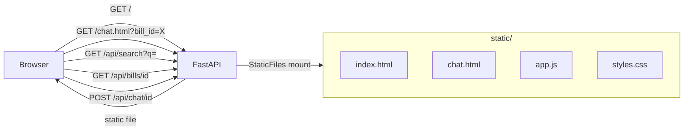

# Frontend Implementation Plan

> **For agentic workers:** REQUIRED: Use superpowers:subagent-driven-development (if subagents available) or superpowers:executing-plans to implement this plan. Steps use checkbox (`- [ ]`) syntax for tracking.

**Goal:** Me want shiny frontend! Build minimal static HTML/CSS/JS served by FastAPI — search page hit `/api/search`, chat page hit `/api/chat/{bill_id}` — finish end-to-end user journey. No build step. No framework. Pure cave painting in browser.

**Architecture:** Static files live in `static/`. FastAPI `StaticFiles` mount registered LAST in `app/main.py` so API routes win first. Two pages: `index.html` (search bar + result cards) and `chat.html` (multi-turn chatbot). `app.js` own all fetch calls and keep in-memory conversation history for stateless chat endpoint. Tests verify static files served correctly. Functional correctness verified manually in browser.

**Tech Stack:** FastAPI `StaticFiles`, Vanilla HTML/CSS/JS, httpx (already in dev deps).

**Depends on:** `2026-04-26-chatbot-api.md` — need `GET /api/search`, `GET /api/bills/{id}`, `POST /api/chat/{bill_id}` alive. Apply Plans 1 + 2 + 3 before running browser smoke test.

---

## Architecture



Mount order: API routers first, `StaticFiles("/")` last. FastAPI resolve API routes before fall through to static files.

---

## File Map

| File | Action | Responsibility |
|------|--------|----------------|
| `app/main.py` | Modify | Add `StaticFiles` mount at `/` after existing API routers |
| `static/index.html` | Create | Search page: input, results area |
| `static/chat.html` | Create | Chat page: bill title header, message history, input |
| `static/app.js` | Create | `performSearch()`, `initChat()`, `sendMessage()`, conversation history, `escapeHtml()`, `safeUrl()` |
| `static/styles.css` | Create | Minimal CSS: layout, cards, chat bubbles |
| `tests/test_static_serving.py` | Create | Verify static files served at correct paths |

---

## Task 1: Static File Serving

**Files:**
- Modify: `app/main.py`
- Create: `static/index.html` (placeholder — full version in Task 2)
- Create: `tests/test_static_serving.py`

- [ ] **Step 1: Write failing tests**

Create `tests/test_static_serving.py`:

```python
import pytest
from fastapi.testclient import TestClient
from app.main import app

client = TestClient(app)


def test_index_page_served():
    resp = client.get("/")
    assert resp.status_code == 200
    assert "text/html" in resp.headers["content-type"]


def test_chat_page_served():
    resp = client.get("/chat.html")
    assert resp.status_code == 200
    assert "text/html" in resp.headers["content-type"]


def test_app_js_served():
    resp = client.get("/app.js")
    assert resp.status_code == 200
    assert "javascript" in resp.headers["content-type"]


def test_styles_css_served():
    resp = client.get("/styles.css")
    assert resp.status_code == 200
    assert "css" in resp.headers["content-type"]


def test_api_routes_not_shadowed_by_static():
    """API routes must resolve before static file fallback."""
    resp = client.get("/api/bills/nonexistent-id")
    assert resp.status_code == 404
    assert resp.headers["content-type"].startswith("application/json")
```

> **Note on TestClient + StaticFiles:** `TestClient` works correctly with `StaticFiles` — no known issues. Files referenced by tests must exist on disk when tests run. All four placeholder static files are created in Step 3 before `Step 5: Run tests`.

- [ ] **Step 2: Run to confirm failure**

```bash
uv run pytest tests/test_static_serving.py -v
```

Expected: `AssertionError: 404 != 200` for all static-serving tests (mount not yet added) and `404` with wrong content-type for the API shadowing test.

- [ ] **Step 3: Create placeholder static files**

```bash
mkdir -p static
```

Create `static/index.html` (placeholder, full version in Task 2):

```html
<!DOCTYPE html>
<html lang="en">
<head><meta charset="UTF-8"><title>Bill Search</title></head>
<body><h1>Bill Search</h1></body>
</html>
```

Create `static/chat.html` (placeholder, full version in Task 3):

```html
<!DOCTYPE html>
<html lang="en">
<head><meta charset="UTF-8"><title>Chat</title></head>
<body><h1>Chat</h1></body>
</html>
```

Create `static/app.js` (placeholder, full version in Task 4):

```javascript
// Bill Retrieval Chatbot — app.js
```

Create `static/styles.css` (placeholder, full version in Task 5):

```css
/* Bill Retrieval Chatbot — styles.css */
```

- [ ] **Step 4: Mount `StaticFiles` in `app/main.py`**

`app/main.py` already has bills, search, and chat routers from Plans 2+3. Add the `StaticFiles` import and mount at the **end** of the file — do not replace existing router registrations:

```python
from fastapi.staticfiles import StaticFiles

# ... existing router includes remain unchanged above this line ...
app.mount("/", StaticFiles(directory="static", html=True), name="static")
```

> **Path note:** `directory="static"` is relative to CWD. Server must be started from repo root (`uv run uvicorn app.main:app --reload`). If CWD differs at runtime, use `Path(__file__).parent.parent / "static"` instead.

- [ ] **Step 5: Run tests**

```bash
uv run pytest tests/test_static_serving.py -v
```

Expected: 5 PASSED.

- [ ] **Step 6: Run full suite**

```bash
uv run pytest -v
```

Expected: all tests PASS.

- [ ] **Step 7: Commit**

```bash
git add app/main.py static/ tests/test_static_serving.py
git commit -m "feat: serve static files via FastAPI StaticFiles mount"
```

---

## Task 2: Search Page (`index.html`)

**Files:**
- Modify: `static/index.html`

No automated tests — functionality verified manually in browser.

- [ ] **Step 1: Replace `static/index.html` with full implementation**

```html
<!DOCTYPE html>
<html lang="en">
<head>
    <meta charset="UTF-8">
    <meta name="viewport" content="width=device-width, initial-scale=1.0">
    <title>Congress Bill Search</title>
    <link rel="stylesheet" href="styles.css">
</head>
<body>
    <div class="container">
        <header>
            <h1>Congress Bill Search</h1>
            <p class="subtitle">Search US legislative bills by topic or keyword</p>
        </header>
        <div class="search-box">
            <input
                type="text"
                id="searchInput"
                placeholder="e.g. climate change, tax reform, healthcare..."
                onkeydown="if(event.key==='Enter') performSearch()"
            >
            <button onclick="performSearch()">Search</button>
        </div>
        <div id="statusMsg" class="status-msg"></div>
        <div id="resultsArea"></div>
    </div>
    <script src="app.js"></script>
</body>
</html>
```

- [ ] **Step 2: Commit**

```bash
git add static/index.html
git commit -m "feat: search page UI"
```

---

## Task 3: Chat Page (`chat.html`)

**Files:**
- Modify: `static/chat.html`

No automated tests — functionality verified manually in browser.

- [ ] **Step 1: Replace `static/chat.html` with full implementation**

```html
<!DOCTYPE html>
<html lang="en">
<head>
    <meta charset="UTF-8">
    <meta name="viewport" content="width=device-width, initial-scale=1.0">
    <title>Chat — Bill Retrieval</title>
    <link rel="stylesheet" href="styles.css">
</head>
<body>
    <div class="chat-container">
        <header class="chat-header">
            <a href="/" class="back-btn">← Back to Search</a>
            <h2 id="billTitle">Loading bill...</h2>
        </header>
        <div id="chatHistory" class="chat-history">
            <div class="msg bot-msg">
                Hello! I've read the bill. Ask me anything about it.
            </div>
        </div>
        <div class="chat-input-area">
            <input
                type="text"
                id="userMsg"
                placeholder="Ask a question about this bill..."
                onkeydown="if(event.key==='Enter') sendMessage()"
            >
            <button id="sendBtn" onclick="sendMessage()">Send</button>
        </div>
    </div>
    <script src="app.js"></script>
    <script>
        const billId = new URLSearchParams(window.location.search).get('bill_id');
        if (!billId) {
            document.getElementById('billTitle').textContent = 'Error: no bill selected';
        } else {
            initChat(billId);
        }
    </script>
</body>
</html>
```

- [ ] **Step 2: Commit**

```bash
git add static/chat.html
git commit -m "feat: chat page UI"
```

---

## Task 4: JavaScript (`app.js`)

**Files:**
- Modify: `static/app.js`

`messageHistory` is module-level — persists across `sendMessage()` calls for the duration of the page session. Each call to `POST /api/chat/{bill_id}` receives the full history, matching the stateless API contract.

API shapes consumed:
- `GET /api/search` → `SearchResponse { query: str, results: BillSummaryOut[] }` where `BillSummaryOut` has `bill_id, title, summary, chamber, introduced_date, bill_url, score`
- `GET /api/bills/{id}` → `BillOut { bill_id, title, ... }`
- `POST /api/chat/{bill_id}` body: `{ messages: [{ role: "user"|"assistant", content: str }] }` → `{ bill_id, response }`

No automated tests — functionality verified manually in browser via the smoke test in Task 6.

- [ ] **Step 1: Replace `static/app.js` with full implementation**

```javascript
/* global state for chat page */
let messageHistory = [];
let activeBillId = null;

/* ── Search Page ── */

async function performSearch() {
    const query = document.getElementById('searchInput').value.trim();
    if (!query) return;

    const statusMsg = document.getElementById('statusMsg');
    const resultsArea = document.getElementById('resultsArea');
    statusMsg.textContent = 'Searching...';
    resultsArea.innerHTML = '';

    try {
        const resp = await fetch(`/api/search?q=${encodeURIComponent(query)}&limit=20`);
        if (!resp.ok) throw new Error(`Search failed: ${resp.status}`);
        const data = await resp.json();

        statusMsg.textContent = `${data.results.length} result(s) for "${data.query}"`;

        if (data.results.length === 0) {
            resultsArea.innerHTML = '<p class="no-results">No bills matched your query.</p>';
            return;
        }

        resultsArea.innerHTML = data.results.map(bill => `
            <div class="result-card">
                <div class="result-meta">
                    ${escapeHtml(bill.chamber || '')} &bull; ${escapeHtml(bill.introduced_date || 'Unknown date')}
                </div>
                <h3 class="result-title">${escapeHtml(bill.title || bill.bill_id)}</h3>
                <p class="result-summary">${escapeHtml((bill.summary || '').slice(0, 200))}${bill.summary && bill.summary.length > 200 ? '…' : ''}</p>
                <div class="result-actions">
                    ${bill.bill_url && safeUrl(bill.bill_url) ? `<a href="${escapeHtml(safeUrl(bill.bill_url))}" target="_blank" rel="noopener noreferrer">View on Congress.gov</a>` : ''}
                    <button onclick="window.location.href='/chat.html?bill_id=${encodeURIComponent(bill.bill_id)}'">
                        Chat with Bill
                    </button>
                </div>
            </div>
        `).join('');
    } catch (err) {
        statusMsg.textContent = `Error: ${err.message}`;
    }
}

/* ── Chat Page ── */

async function initChat(billId) {
    activeBillId = billId;
    messageHistory = [];

    try {
        const resp = await fetch(`/api/bills/${encodeURIComponent(billId)}`);
        if (!resp.ok) throw new Error(`Bill not found: ${resp.status}`);
        const bill = await resp.json();
        document.getElementById('billTitle').textContent =
            bill.title || billId;
        document.title = `Chat — ${bill.title || billId}`;
    } catch (err) {
        document.getElementById('billTitle').textContent = `Error loading bill: ${err.message}`;
    }
}

async function sendMessage() {
    const input = document.getElementById('userMsg');
    const sendBtn = document.getElementById('sendBtn');
    const text = input.value.trim();
    if (!text || !activeBillId) return;

    input.value = '';
    sendBtn.disabled = true;

    messageHistory.push({ role: 'user', content: text });
    appendMessage('user', text);
    appendMessage('bot', '…', 'thinking');

    try {
        const resp = await fetch(`/api/chat/${encodeURIComponent(activeBillId)}`, {
            method: 'POST',
            headers: { 'Content-Type': 'application/json' },
            body: JSON.stringify({ messages: messageHistory }),
        });
        if (!resp.ok) throw new Error(`Chat error: ${resp.status}`);
        const data = await resp.json();

        removeThinking();
        messageHistory.push({ role: 'assistant', content: data.response });
        appendMessage('bot', data.response);
    } catch (err) {
        removeThinking();
        appendMessage('bot', `Error: ${err.message}`);
    } finally {
        sendBtn.disabled = false;
        input.focus();
    }
}

/* ── UI helpers ── */

function appendMessage(role, text, className) {
    const div = document.createElement('div');
    div.className = `msg ${role === 'user' ? 'user-msg' : 'bot-msg'}${className ? ' ' + className : ''}`;
    div.textContent = text;
    const history = document.getElementById('chatHistory');
    history.appendChild(div);
    history.scrollTop = history.scrollHeight;
}

function removeThinking() {
    const el = document.querySelector('.thinking');
    if (el) el.remove();
}

function escapeHtml(str) {
    return String(str)
        .replace(/&/g, '&amp;')
        .replace(/</g, '&lt;')
        .replace(/>/g, '&gt;')
        .replace(/"/g, '&quot;')
        .replace(/'/g, '&#39;');
}

/**
 * Return url unchanged if scheme is http or https; otherwise return null.
 * Prevents javascript: and data: URLs from reaching href attributes.
 */
function safeUrl(url) {
    try {
        const parsed = new URL(url);
        return (parsed.protocol === 'https:' || parsed.protocol === 'http:') ? url : null;
    } catch (_) {
        return null;
    }
}
```

- [ ] **Step 2: Commit**

```bash
git add static/app.js
git commit -m "feat: search and chat JavaScript"
```

---

## Task 5: CSS (`styles.css`)

**Files:**
- Modify: `static/styles.css`

- [ ] **Step 1: Replace `static/styles.css` with full implementation**

```css
*, *::before, *::after { box-sizing: border-box; margin: 0; padding: 0; }

body {
    font-family: -apple-system, BlinkMacSystemFont, 'Segoe UI', sans-serif;
    background: #f5f5f5;
    color: #222;
    min-height: 100vh;
}

/* ── Search Page ── */

.container {
    max-width: 800px;
    margin: 0 auto;
    padding: 2rem 1rem;
}

header h1 { font-size: 2rem; margin-bottom: 0.25rem; }
.subtitle { color: #666; margin-bottom: 1.5rem; }

.search-box {
    display: flex;
    gap: 0.5rem;
    margin-bottom: 1rem;
}

.search-box input {
    flex: 1;
    padding: 0.75rem 1rem;
    font-size: 1rem;
    border: 2px solid #ccc;
    border-radius: 6px;
    outline: none;
}
.search-box input:focus { border-color: #1a56db; }

.search-box button, button {
    padding: 0.75rem 1.5rem;
    font-size: 1rem;
    background: #1a56db;
    color: white;
    border: none;
    border-radius: 6px;
    cursor: pointer;
}
button:hover { background: #1e40af; }
button:disabled { background: #9ca3af; cursor: not-allowed; }

.status-msg { color: #555; margin-bottom: 1rem; min-height: 1.25rem; }

.no-results { color: #888; }

.result-card {
    background: white;
    border: 1px solid #e0e0e0;
    border-radius: 8px;
    padding: 1.25rem;
    margin-bottom: 1rem;
}

.result-meta { font-size: 0.8rem; color: #888; margin-bottom: 0.25rem; }
.result-title { font-size: 1.1rem; margin-bottom: 0.5rem; }
.result-summary { color: #555; font-size: 0.9rem; margin-bottom: 0.75rem; line-height: 1.5; }

.result-actions {
    display: flex;
    gap: 0.75rem;
    align-items: center;
    flex-wrap: wrap;
}
.result-actions a {
    color: #1a56db;
    font-size: 0.9rem;
    text-decoration: none;
}
.result-actions a:hover { text-decoration: underline; }
.result-actions button { padding: 0.5rem 1rem; font-size: 0.9rem; }

/* ── Chat Page ── */

.chat-container {
    display: flex;
    flex-direction: column;
    height: 100vh;
    max-width: 800px;
    margin: 0 auto;
}

.chat-header {
    padding: 1rem;
    background: white;
    border-bottom: 1px solid #e0e0e0;
    display: flex;
    align-items: center;
    gap: 1rem;
}
.chat-header h2 { font-size: 1.1rem; flex: 1; }
.back-btn { color: #1a56db; text-decoration: none; font-size: 0.9rem; white-space: nowrap; }
.back-btn:hover { text-decoration: underline; }

.chat-history {
    flex: 1;
    overflow-y: auto;
    padding: 1rem;
    display: flex;
    flex-direction: column;
    gap: 0.75rem;
}

.msg {
    max-width: 75%;
    padding: 0.75rem 1rem;
    border-radius: 12px;
    line-height: 1.5;
    font-size: 0.95rem;
    white-space: pre-wrap;
}
.user-msg {
    background: #1a56db;
    color: white;
    align-self: flex-end;
    border-bottom-right-radius: 3px;
}
.bot-msg {
    background: white;
    border: 1px solid #e0e0e0;
    align-self: flex-start;
    border-bottom-left-radius: 3px;
}
.thinking { color: #888; font-style: italic; }

.chat-input-area {
    padding: 1rem;
    background: white;
    border-top: 1px solid #e0e0e0;
    display: flex;
    gap: 0.5rem;
}
.chat-input-area input {
    flex: 1;
    padding: 0.75rem 1rem;
    font-size: 1rem;
    border: 2px solid #ccc;
    border-radius: 6px;
    outline: none;
}
.chat-input-area input:focus { border-color: #1a56db; }
```

- [ ] **Step 2: Commit**

```bash
git add static/styles.css
git commit -m "feat: styles for search and chat pages"
```

---

## Task 6: End-to-End Browser Smoke Test

No new files — verify full flow manually with populated database.

- [ ] **Step 1: Start services and populate DB**

```bash
docker compose up -d postgres
uv run alembic upgrade head

# Universe DL + embed (skip if already done from Plans 1-3)
uv run python -m app.cli universe-dl /path/to/congress/data/bills/
uv run python -m app.cli embed-bills
```

- [ ] **Step 2: Start the server**

```bash
uv run uvicorn app.main:app --reload
```

- [ ] **Step 3: Test search flow**

Open `http://localhost:8000` in browser.

Search for "climate" — verify:
- Result cards appear with titles and summaries
- "Chat with Bill" button visible per card
- "View on Congress.gov" link present and opens right URL

- [ ] **Step 4: Test chat flow**

Click "Chat with Bill" on any result.

Verify:
- Chat page loads with bill title in header
- "Hello! I've read the bill..." greeting visible
- Typing question and pressing Enter or clicking Send shows user message (blue bubble)
- Ellipsis "..." appears while waiting
- LLM reply appears (white bubble)
- Follow-up questions maintain conversation context

- [ ] **Step 5: Test edge cases**

- Search with empty query — button do nothing (no request)
- Search returning 0 results — "No bills matched your query." message
- Navigate back with "← Back to Search" — returns to search page

- [ ] **Step 6: Run full test suite one final time**

```bash
uv run pytest -v
```

Expected: all tests PASS.

---

## Open Questions / Deferred

1. **Full bill text for chat:** `POST /api/chat/{bill_id}` currently uses title + summary as context. When `bill_texts` table added (future), no frontend changes needed — API upgrades transparently.
2. **Markdown rendering:** LLM replies often include markdown. Future improvement: render responses with library like `marked.js`. Current `textContent` assignment is XSS-safe.
3. **Loading state for search:** Large result sets with embedding-less DB take time. Add spinner or progress indicator to search box in future pass.
4. **Mobile responsiveness:** CSS uses max-width containers and flex layout. Works on mobile without horizontal scroll, but touch input and font sizes not tuned.
5. **CORS:** If frontend moves to different origin (e.g., CDN), add `CORSMiddleware` to `app/main.py`. No changes to static files needed.
6. **Error display for chat 404:** If `bill_id` in query param is invalid, `initChat` shows error message in bill title area. Dedicated error page would be more user-friendly.
7. **Favicon:** Browser auto-requests `/favicon.ico`. No `favicon.ico` in `static/` — `StaticFiles` returns 404. Harmless but generates a log entry. Add a favicon in a future pass if desired.
