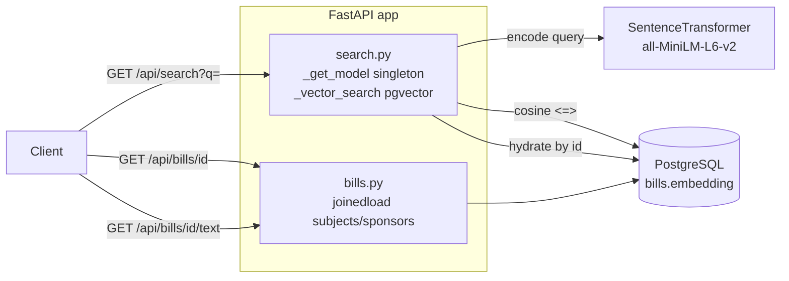

# Search + Bill Data API Implementation Plan

> **For agentic workers:** REQUIRED: Use superpowers:subagent-driven-development (if subagents available) or superpowers:executing-plans to implement this plan. Steps use checkbox (`- [ ]`) syntax for tracking.

**Goal:** FastAPI layer — semantic bill search (pgvector cosine similarity) + bill detail endpoints. JSON API consumed by chatbot frontend and Plan 3 chatbot service.

**Depends on:** `2026-04-26-schema-enrichment-embedding-pipeline.md` — need `embedding` column, `LegislativeSubject` model, `bill_subjects` join table, `introduced_date`/`chamber`/`bill_url` columns on `bills`. Apply Plan 1 migrations before running any tests here.

**Required by:** `2026-04-26-chatbot-api.md` — chatbot calls `GET /api/bills/{id}/text` to build LLM context.

**Tech Stack:** FastAPI, SQLAlchemy 2.x, Pydantic v2, sentence-transformers, pgvector, pytest + httpx (already in dev deps).

---

## Architecture



Three route groups under `/api`:
- `search` — encode query → pgvector `<=>` cosine sim → hydrate bill rows
- `bills/{id}` — metadata + subjects + sponsors (eager loaded)
- `bills/{id}/text` — title + summary payload for chatbot context

Model singleton (`_model_instance`) loaded once at first request. `_vector_search` abstracted as separate fn — mockable in unit tests without hitting Postgres. Unit tests: SQLite in-memory, `_get_model` + `_vector_search` mocked. Bill detail tests: SQLite, no mocks needed.

---

## File Map

| File | Action | Responsibility |
|------|--------|----------------|
| `app/main.py` | Create | FastAPI app entry point; mounts API routers |
| `app/api/__init__.py` | Create | Package init (empty) |
| `app/api/deps.py` | Create | `get_db` FastAPI dependency (yields `Session`) |
| `app/api/schemas.py` | Create | Pydantic response models: `BillOut`, `BillTextOut`, `BillSummaryOut`, `SearchResponse` |
| `app/api/bills.py` | Create | `GET /api/bills/{id}` and `GET /api/bills/{id}/text` |
| `app/api/search.py` | Create | `GET /api/search?q=&limit=` — query encoding + pgvector similarity |
| `tests/api/__init__.py` | Create | Package init (empty) |
| `tests/api/conftest.py` | Create | `TestClient` fixture, SQLite DB fixture, `make_bill` helper |
| `tests/api/test_bills.py` | Create | Tests for bill detail and text endpoints |
| `tests/api/test_search.py` | Create | Tests for search endpoint (mocked encoder + mocked vector search) |

---

## Task 1: Pydantic Schemas

**Files:**
- Create: `app/api/__init__.py`
- Create: `app/api/schemas.py`

Pure Pydantic, no DB or external deps. Serialization validated implicitly via endpoint tests in Tasks 3–4.

- [ ] **Step 1: Create `app/api/__init__.py`** (empty file)

- [ ] **Step 2: Create `app/api/schemas.py`**

```python
from pydantic import BaseModel


class SponsorOut(BaseModel):
    bioguide_id: str
    full_name: str | None
    party: str | None
    state: str | None

    model_config = {"from_attributes": True}


class BillOut(BaseModel):
    bill_id: str
    congress: int
    bill_type: str
    bill_number: int
    title: str | None
    summary: str | None
    latest_action: str | None
    latest_action_date: str | None
    introduced_date: str | None
    chamber: str | None
    bill_url: str | None
    subjects: list[str]
    sponsors: list[SponsorOut]
    cosponsors: list[SponsorOut]

    # SponsorOut items validated via from_attributes when passed as ORM list
    model_config = {"from_attributes": True}

    @classmethod
    def from_orm_bill(cls, bill) -> "BillOut":
        return cls(
            bill_id=bill.bill_id,
            congress=bill.congress,
            bill_type=bill.bill_type,
            bill_number=bill.bill_number,
            title=bill.title,
            summary=bill.summary,
            latest_action=bill.latest_action,
            latest_action_date=bill.latest_action_date,
            introduced_date=bill.introduced_date,
            chamber=bill.chamber,
            bill_url=bill.bill_url,
            subjects=[s.name for s in bill.subjects],
            sponsors=bill.sponsors,
            cosponsors=bill.cosponsors,
        )


class BillTextOut(BaseModel):
    bill_id: str
    title: str | None
    text: str


class BillSummaryOut(BaseModel):
    bill_id: str
    title: str | None
    summary: str | None
    chamber: str | None
    introduced_date: str | None
    bill_url: str | None
    score: float


class SearchResponse(BaseModel):
    query: str
    results: list[BillSummaryOut]
```

- [ ] **Step 3: Commit**

```bash
git add app/api/__init__.py app/api/schemas.py
git commit -m "feat: add API Pydantic schemas"
```

---

## Task 2: DB Dependency + `app/main.py`

**Files:**
- Create: `app/api/deps.py`
- Create: `app/main.py`

- [ ] **Step 1: Create `app/api/deps.py`**

`SessionLocal` is a `sessionmaker` factory (`session.py`). Use `try/finally` so errors during request trigger rollback before close — `Session.__exit__` only calls `close()`, not `rollback()`.

```python
from collections.abc import Generator
from sqlalchemy.orm import Session
from app.db.session import SessionLocal


def get_db() -> Generator[Session, None, None]:
    db: Session = SessionLocal()
    try:
        yield db
    except Exception:
        db.rollback()
        raise
    finally:
        db.close()
```

- [ ] **Step 2: Create `app/main.py`**

```python
from fastapi import FastAPI
from app.api import bills, search

app = FastAPI(title="Bill Retrieval API", version="0.1.0")
app.include_router(bills.router, prefix="/api")
app.include_router(search.router, prefix="/api")
```

- [ ] **Step 3: Commit**

```bash
git add app/api/deps.py app/main.py
git commit -m "feat: FastAPI app entry point and DB dependency"
```

---

## Task 3: Bill Detail Endpoints

**Files:**
- Create: `app/api/bills.py`
- Create: `tests/api/__init__.py`
- Create: `tests/api/conftest.py`
- Create: `tests/api/test_bills.py`

Bill detail endpoints run against SQLite in-memory — ORM queries + `joinedload` work identically on SQLite and PostgreSQL for this schema.

**Prerequisite:** Plan 1 migrations applied. `models.py` must have `introduced_date`, `chamber`, `bill_url` on `Bill` and `LegislativeSubject` model with `bill_subjects` join table. Tests will fail with `TypeError`/`AttributeError` if run before Plan 1.

- [ ] **Step 1: Write failing tests**

Create `tests/api/__init__.py` (empty).

Create `tests/api/conftest.py`:

```python
import pytest
from fastapi.testclient import TestClient
from sqlalchemy import create_engine
from sqlalchemy.orm import sessionmaker
from app.db.session import Base
from app.db import models
from app.api.deps import get_db
from app.main import app


@pytest.fixture
def db_engine():
    engine = create_engine("sqlite:///:memory:")
    Base.metadata.create_all(engine)
    yield engine
    Base.metadata.drop_all(engine)


@pytest.fixture
def db(db_engine):
    Session = sessionmaker(bind=db_engine)
    session = Session()
    yield session
    session.close()


@pytest.fixture
def client(db):
    app.dependency_overrides[get_db] = lambda: db
    yield TestClient(app)
    app.dependency_overrides.clear()


def make_bill(db, bill_id="118-hr-1", **kwargs) -> models.Bill:
    defaults = dict(
        congress=118,
        bill_type="hr",
        bill_number=1,
        title="Test Bill",
        summary="A test summary.",
        latest_action="Passed",
        latest_action_date="2023-01-15",
        last_updated="2023-01-15T10:00:00Z",
        introduced_date="2023-01-05",
        chamber="House",
        bill_url="https://www.congress.gov/bill/118th-congress/house-bill/1",
    )
    defaults.update(kwargs)
    bill = models.Bill(bill_id=bill_id, **defaults)
    db.add(bill)
    db.commit()
    db.refresh(bill)
    return bill
```

Create `tests/api/test_bills.py`:

```python
from tests.api.conftest import make_bill
from app.db import models


def test_get_bill_returns_200(client, db):
    make_bill(db)
    resp = client.get("/api/bills/118-hr-1")
    assert resp.status_code == 200


def test_get_bill_returns_correct_fields(client, db):
    make_bill(db)
    data = client.get("/api/bills/118-hr-1").json()
    assert data["bill_id"] == "118-hr-1"
    assert data["title"] == "Test Bill"
    assert data["chamber"] == "House"
    assert data["introduced_date"] == "2023-01-05"
    assert data["bill_url"] == "https://www.congress.gov/bill/118th-congress/house-bill/1"
    assert isinstance(data["subjects"], list)
    assert isinstance(data["sponsors"], list)


def test_get_bill_includes_subjects(client, db):
    bill = make_bill(db)
    subject = models.LegislativeSubject(name="Health care")
    bill.subjects.append(subject)
    db.commit()
    data = client.get("/api/bills/118-hr-1").json()
    assert "Health care" in data["subjects"]


def test_get_bill_includes_sponsors(client, db):
    bill = make_bill(db)
    sponsor = models.Sponsor(
        bioguide_id="A000001", full_name="Jane Doe", party="D", state="CA"
    )
    bill.sponsors.append(sponsor)
    db.commit()
    data = client.get("/api/bills/118-hr-1").json()
    assert len(data["sponsors"]) == 1
    assert data["sponsors"][0]["bioguide_id"] == "A000001"
    assert data["sponsors"][0]["full_name"] == "Jane Doe"


def test_get_bill_not_found(client, db):
    resp = client.get("/api/bills/999-hr-9999")
    assert resp.status_code == 404


def test_get_bill_text_returns_200(client, db):
    make_bill(db)
    resp = client.get("/api/bills/118-hr-1/text")
    assert resp.status_code == 200


def test_get_bill_text_contains_title_and_summary(client, db):
    make_bill(db, title="Climate Bill", summary="Reduces emissions.")
    data = client.get("/api/bills/118-hr-1/text").json()
    assert data["bill_id"] == "118-hr-1"
    assert data["title"] == "Climate Bill"
    assert "Climate Bill" in data["text"]
    assert "Reduces emissions." in data["text"]


def test_get_bill_text_fallback_when_no_content(client, db):
    make_bill(db, title=None, summary=None)
    data = client.get("/api/bills/118-hr-1/text").json()
    assert data["text"] == "118-hr-1"


def test_get_bill_text_not_found(client, db):
    resp = client.get("/api/bills/999-hr-9999/text")
    assert resp.status_code == 404
```

- [ ] **Step 2: Run to confirm failure**

```bash
uv run pytest tests/api/test_bills.py -v
```

Expected: `ImportError: cannot import name 'bills' from 'app.api'`

- [ ] **Step 3: Implement `app/api/bills.py`**

```python
from fastapi import APIRouter, Depends, HTTPException
from sqlalchemy.orm import Session, joinedload
from app.api.deps import get_db
from app.api.schemas import BillOut, BillTextOut
from app.db import models

router = APIRouter()


def _get_bill_or_404(db: Session, bill_id: str) -> models.Bill:
    bill = (
        db.query(models.Bill)
        .options(
            joinedload(models.Bill.subjects),
            joinedload(models.Bill.sponsors),
            joinedload(models.Bill.cosponsors),
        )
        .filter(models.Bill.bill_id == bill_id)
        .first()
    )
    if bill is None:
        raise HTTPException(status_code=404, detail=f"Bill {bill_id!r} not found")
    return bill


@router.get("/bills/{bill_id}", response_model=BillOut)
def get_bill(bill_id: str, db: Session = Depends(get_db)):
    return BillOut.from_orm_bill(_get_bill_or_404(db, bill_id))


@router.get("/bills/{bill_id}/text", response_model=BillTextOut)
def get_bill_text(bill_id: str, db: Session = Depends(get_db)):
    bill = _get_bill_or_404(db, bill_id)
    parts = [bill.title or "", bill.summary or ""]
    text = "\n\n".join(p for p in parts if p).strip() or bill_id
    return BillTextOut(bill_id=bill.bill_id, title=bill.title, text=text)
```

- [ ] **Step 4: Run tests**

```bash
uv run pytest tests/api/test_bills.py -v
```

Expected: 9 PASSED.

- [ ] **Step 5: Commit**

```bash
git add app/api/bills.py tests/api/__init__.py tests/api/conftest.py tests/api/test_bills.py
git commit -m "feat: GET /api/bills/{id} and /api/bills/{id}/text endpoints"
```

---

## Task 4: Search Endpoint

**Files:**
- Create: `app/api/search.py`
- Create: `tests/api/test_search.py`

Encode query with `SentenceTransformer` (same model as embedding pipeline, lazy singleton). pgvector `<=>` cosine sim via `_vector_search` helper. `<=>` is Postgres-only — unit tests mock both `_get_model` and `_vector_search`. `_hydrate_results` fetches full bill rows by ID, works on SQLite.

`_vector_search` signature uses keyword-only `limit` (`*` separator) so `mock.call_args` unpacks cleanly as `args=(db, vec)`, `kwargs={"limit": N}`.

- [ ] **Step 1: Write failing tests**

Create `tests/api/test_search.py`:

```python
import numpy as np
from unittest.mock import patch, MagicMock
from tests.api.conftest import make_bill


def _mock_model():
    model = MagicMock()
    model.encode.return_value = np.zeros(384, dtype=np.float32)
    return model


def test_search_returns_200(client, db):
    with patch("app.api.search._get_model", return_value=_mock_model()), \
         patch("app.api.search._vector_search", return_value=[]):
        resp = client.get("/api/search?q=healthcare")
    assert resp.status_code == 200


def test_search_missing_query_returns_422(client, db):
    resp = client.get("/api/search")
    assert resp.status_code == 422


def test_search_returns_matching_results(client, db):
    make_bill(db)
    with patch("app.api.search._get_model", return_value=_mock_model()), \
         patch("app.api.search._vector_search", return_value=[
             {"bill_id": "118-hr-1", "score": 0.95}
         ]):
        data = client.get("/api/search?q=health").json()
    assert data["query"] == "health"
    assert len(data["results"]) == 1
    assert data["results"][0]["bill_id"] == "118-hr-1"
    assert data["results"][0]["score"] == 0.95


def test_search_encodes_query_string(client, db):
    model = _mock_model()
    with patch("app.api.search._get_model", return_value=model), \
         patch("app.api.search._vector_search", return_value=[]):
        client.get("/api/search?q=climate+change")
    model.encode.assert_called_once_with("climate change")


def test_search_passes_limit_to_vector_search(client, db):
    with patch("app.api.search._get_model", return_value=_mock_model()), \
         patch("app.api.search._vector_search", return_value=[]) as mock_vs:
        client.get("/api/search?q=test&limit=5")
    _, kwargs = mock_vs.call_args
    assert kwargs["limit"] == 5


def test_search_default_limit_is_10(client, db):
    with patch("app.api.search._get_model", return_value=_mock_model()), \
         patch("app.api.search._vector_search", return_value=[]) as mock_vs:
        client.get("/api/search?q=test")
    _, kwargs = mock_vs.call_args
    assert kwargs["limit"] == 10


def test_search_unknown_bill_ids_dropped_from_results(client, db):
    """Bills returned by vector search but missing from DB are silently dropped."""
    with patch("app.api.search._get_model", return_value=_mock_model()), \
         patch("app.api.search._vector_search", return_value=[
             {"bill_id": "999-hr-9999", "score": 0.80}
         ]):
        data = client.get("/api/search?q=ghost").json()
    assert len(data["results"]) == 0
```

- [ ] **Step 2: Run to confirm failure**

```bash
uv run pytest tests/api/test_search.py -v
```

Expected: `ImportError: cannot import name 'search' from 'app.api'`

- [ ] **Step 3: Implement `app/api/search.py`**

```python
from fastapi import APIRouter, Depends, Query
from sqlalchemy.orm import Session
from sqlalchemy import text
from sentence_transformers import SentenceTransformer
from app.api.deps import get_db
from app.api.schemas import SearchResponse, BillSummaryOut
from app.config import settings

router = APIRouter()

_model_instance: SentenceTransformer | None = None


def _get_model() -> SentenceTransformer:
    global _model_instance
    if _model_instance is None:
        _model_instance = SentenceTransformer(settings.EMBEDDING_MODEL)
    return _model_instance


def _vector_search(db: Session, query_vec: list[float], *, limit: int) -> list[dict]:
    """Cosine similarity search via pgvector. Returns [{bill_id, score}].

    str(query_vec) produces '[0.1, 0.2, ...]' — pgvector accepts this format
    for CAST(:vec AS vector).
    """
    rows = db.execute(
        text(
            "SELECT bill_id, 1 - (embedding <=> CAST(:vec AS vector)) AS score "
            "FROM bills WHERE embedding IS NOT NULL "
            "ORDER BY embedding <=> CAST(:vec AS vector) "
            "LIMIT :limit"
        ),
        {"vec": str(query_vec), "limit": limit},
    ).fetchall()
    return [{"bill_id": row.bill_id, "score": float(row.score)} for row in rows]


def _hydrate_results(db: Session, search_rows: list[dict]) -> list[BillSummaryOut]:
    """Fetch bill rows by ID and merge with similarity scores.

    Iterates original bill_ids order (similarity rank) — IN (...) query does
    not guarantee order, so we re-apply it here via the list comprehension.
    """
    from app.db import models
    bill_ids = [r["bill_id"] for r in search_rows]
    scores = {r["bill_id"]: r["score"] for r in search_rows}
    bills = db.query(models.Bill).filter(models.Bill.bill_id.in_(bill_ids)).all()
    bill_map = {b.bill_id: b for b in bills}
    return [
        BillSummaryOut(
            bill_id=bid,
            title=bill_map[bid].title,
            summary=bill_map[bid].summary,
            chamber=bill_map[bid].chamber,
            introduced_date=bill_map[bid].introduced_date,
            bill_url=bill_map[bid].bill_url,
            score=scores[bid],
        )
        for bid in bill_ids
        if bid in bill_map
    ]


@router.get("/search", response_model=SearchResponse)
def search_bills(
    q: str = Query(..., min_length=1, description="Natural-language search query"),
    limit: int = Query(10, ge=1, le=100),
    db: Session = Depends(get_db),
):
    model = _get_model()
    query_vec = model.encode(q).tolist()
    raw = _vector_search(db, query_vec, limit=limit)
    results = _hydrate_results(db, raw)
    return SearchResponse(query=q, results=results)
```

- [ ] **Step 4: Run search tests**

```bash
uv run pytest tests/api/test_search.py -v
```

Expected: 7 PASSED.

- [ ] **Step 5: Run full suite**

```bash
uv run pytest -v
```

Expected: all tests PASS (existing ingestion + model tests + 9 bill + 7 search = all green).

- [ ] **Step 6: Commit**

```bash
git add app/api/search.py tests/api/test_search.py
git commit -m "feat: GET /api/search endpoint with pgvector cosine similarity"
```

---

## Task 5: Smoke-Test Dev Server

No new tests — verify startup + basic reachability against live database.

- [ ] **Step 1: Start postgres and apply migrations**

```bash
docker compose up -d postgres
uv run alembic upgrade head
```

- [ ] **Step 2: Start the dev server**

```bash
uv run uvicorn app.main:app --reload
```

Expected: `Application startup complete.`

- [ ] **Step 3: Smoke-test endpoints**

```bash
# 404 if no data in DB yet (expected)
curl -s http://localhost:8000/api/bills/118-hr-1 | python -m json.tool

# Empty results if no embeddings yet
curl -s "http://localhost:8000/api/search?q=healthcare" | python -m json.tool
# Expected: {"query": "healthcare", "results": []}

# OpenAPI docs available
open http://localhost:8000/docs
```

- [ ] **Step 4: Commit any fixes found during smoke test**

```bash
git add -p
git commit -m "fix: <describe any startup issues found>"
```

---

## Running with Real Data

After Universe DL + embed-bills from Plan 1:

```bash
uv run python -m app.cli universe-dl /path/to/congress/data/bills/
uv run python -m app.cli embed-bills

uv run uvicorn app.main:app --reload

curl "http://localhost:8000/api/search?q=climate+change+emissions&limit=5"
curl "http://localhost:8000/api/bills/118-hr-1234"
curl "http://localhost:8000/api/bills/118-hr-1234/text"
```

---

## Open Questions / Deferred

1. **Full bill text:** `/api/bills/{id}/text` returns `title + "\n\n" + summary`. Congress.gov has separate full-text XML (`TextVersions`). Future plan adds `bill_texts` table — endpoint contract + Plan 3 consumer stable.
2. **Result ordering:** `_vector_search` preserves cosine-similarity rank from pgvector. `_hydrate_results` `IN (...)` doesn't preserve order — re-applied by iterating original `bill_ids` list in list comprehension.
3. **CORS:** Frontend on different origin → add `CORSMiddleware` to `app/main.py`. One-line change, no plan update needed.
4. **ivfflat index:** Plan 1 creates index post-bulk-load. Without it, `_vector_search` does sequential scan — correct results, slow for >100k rows.
5. **Auth / rate limiting:** Out of scope. Plan 3 may add API key auth if chatbot endpoint is expensive.
